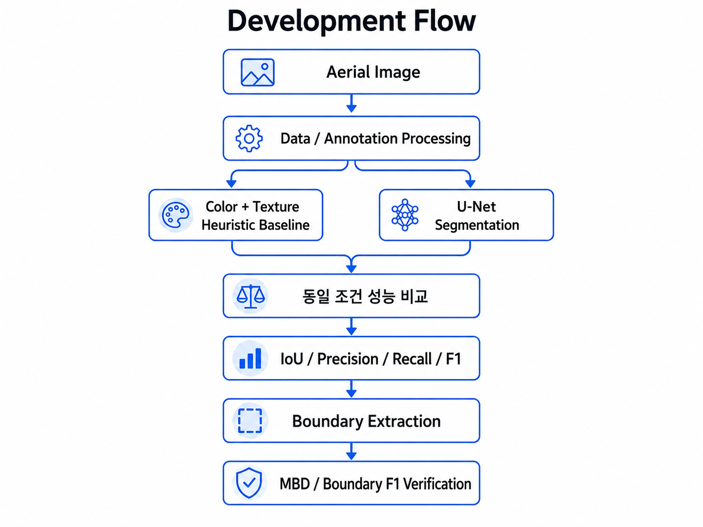

# U-Net 기반 항공영상 수변 영역 분할 및 경계 분석

> 고해상도 항공영상에서 수변 관련 영역을 탐지하기 위해  
> Color + Texture 기반 Heuristic Baseline과 U-Net을 구성하고,  
> 영역 분할 성능뿐만 아니라 경계 위치 오차까지 정량적으로 비교·검증한 프로젝트입니다.

---

## 1. Project Overview

### 프로젝트 목표

고해상도 항공영상으로부터 수변 관련 영역을 탐지하고,
수역과 주변 지형의 경계를 영상 기반으로 분석하는 것을 목표로 하였습니다.

단순히 U-Net 모델을 학습하는 것에 그치지 않고,

**Heuristic Baseline → U-Net 기반 분할 → 후처리 → 정량 비교 → 경계 오차 분석**

순서로 성능을 검증하였습니다.

### 주요 입력 및 출력

**Input**
- RGB 고해상도 항공영상 (GeoTIFF)
- JSON Polygon Annotation

**Output**
- Water-related Binary Mask
- Water Probability Map
- Water / Forest / Sand-Road Boundary Visualization
- Heuristic vs U-Net 정량 비교 결과

### Development Flow

