# U-net 기반 고해상도 항공영상을 활용한 한강 유역 수변구역 탐지

> 고해상도 항공영상에서 수변 관련 영역을 탐지하기 위해  
> Color + Texture 기반 Heuristic Baseline과 U-Net을 구성하고,  
> 영역 분할 성능뿐만 아니라 경계 위치 오차까지 정량적으로 비교·검증한 프로젝트입니다.

---

## 1. Project Overview

### 프로젝트 목표

고해상도 항공영상으로부터 수변 관련 영역을 탐지하고,
수역과 주변 지형의 경계를 영상 기반으로 분석하는 것을 목표로 하였습니다.

단순히 U-Net 모델을 학습하는 것에 그치지 않고,

**Heuristic Baseline → U-Net 기반 분할 → 후처리 → 정량 비교 → 경계 오차 분석**

순서로 성능을 검증하였습니다.

### 주요 입력 및 출력

**Input**
- RGB 고해상도 항공영상 (GeoTIFF)
- JSON Polygon Annotation

**Output**
- Water-related Binary Mask
- Water Probability Map
- Water / Forest / Sand-Road Boundary Visualization
- Heuristic vs U-Net 정량 비교 결과

### Development Flow

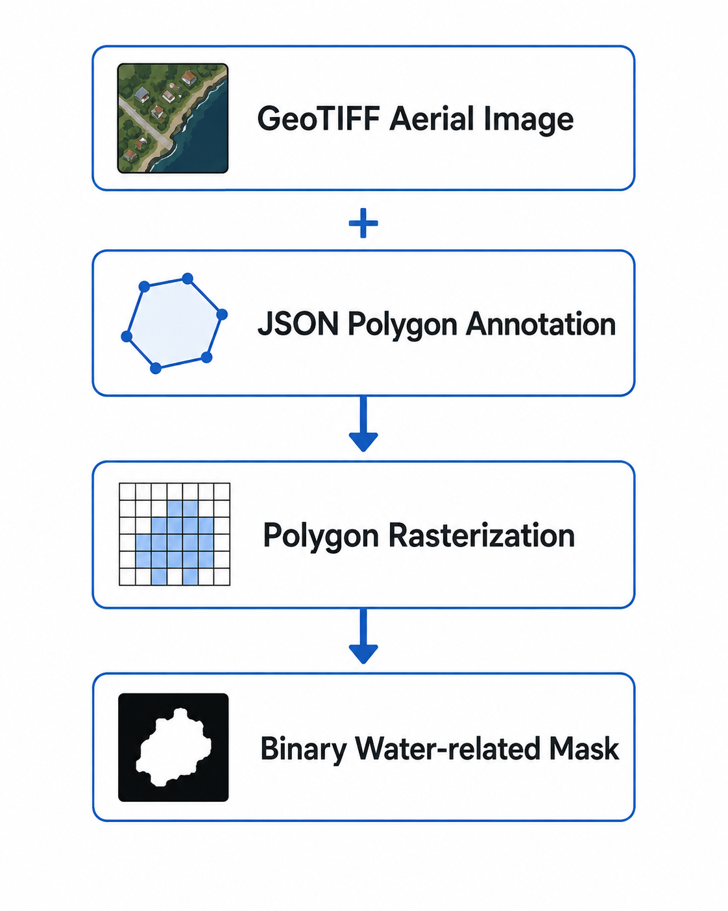


---

## 2. Environment & Constraints

본 프로젝트는 고해상도 항공영상을 이용하여 수변 관련 영역을 분할하고,
수변과 주변 지형의 경계를 분석하는 환경에서 수행하였습니다.

단순히 U-Net 모델을 학습하는 것에 그치지 않고,
입력 데이터 형식, Annotation 구조, 학습용 Mask 생성 방식,
학습 조건 및 성능 검증 조건을 함께 고려하여 개발 환경을 구성하였습니다.

---

### 2.1 Input Data Environment

본 프로젝트는 고해상도 RGB 항공영상을 입력으로 사용하여
수변 관련 영역을 분석하였습니다.

- **Input Image**: RGB 고해상도 항공영상 (GeoTIFF)
- **Annotation**: JSON Polygon Annotation
- **Model Input Size**: 512 × 512
- **Segmentation Type**: Binary Segmentation
- **Positive Class**: 프로젝트에서 정의한 수변 관련 영역
- **Negative Class**: 기타 영역

원본 항공영상과 JSON Polygon Annotation을 이용하여
U-Net 학습에 사용할 Binary Mask를 구성하였습니다.

<p align="center">
  
</p>

---

### 2.2 Annotation Processing

JSON Annotation에 포함된 Polygon 좌표를 영상 좌표계에 맞게 변환한 뒤,
Raster Mask 형태로 변환하여 학습 데이터 구성에 사용하였습니다.

프로젝트 코드에서는 다음 Annotation Code를
수변 관련 Positive Class 구성에 사용하였습니다.

```text
20 / 40 / 50 / 511
```

각 Polygon 영역은 Binary Mask에서 다음과 같이 처리됩니다.

```text
Water-related region  → 1
Other region          → 0
```

Annotation Code의 공식 세부 의미를 임의로 재정의하지 않고,
프로젝트에서 실제 사용한 Code 조건을 그대로 유지하였습니다.

---

### 2.3 Training Mask Construction

학습용 Binary Mask는 JSON Annotation 기반 Mask와 함께,
항공영상의 RGB 색상 및 Local Texture 조건을 이용한 후보 영역을
보완적으로 결합하도록 구성하였습니다.

<p align="center">
  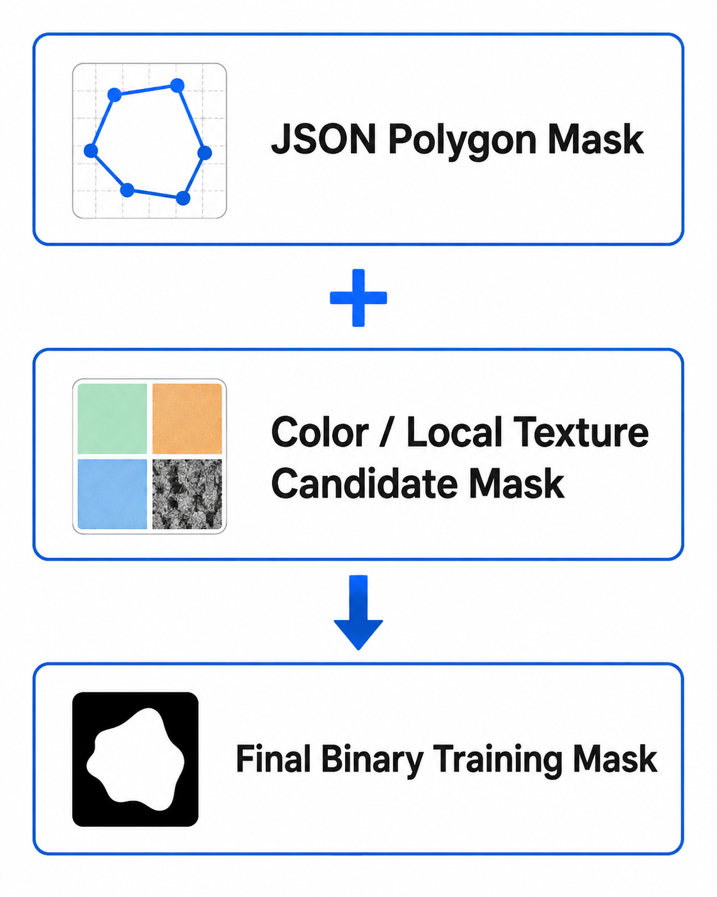
</p>

Color + Texture 기반 후보 영역은 다음 영상 특성을 이용합니다.

- RGB 채널 값
- Green / Red 채널 간 관계
- Local Standard Deviation
- 저질감 영역 여부

이를 통해 Annotation으로 정의된 영역과
영상 자체의 색상·질감 특성을 함께 반영하여
U-Net 학습용 Binary Mask를 생성하였습니다.

---

### 2.4 Model & Training Environment

U-Net은 512 × 512 크기의 RGB 영상을 입력으로 받아
픽셀 단위 Water-related Probability Map을 출력하도록 구성하였습니다.

주요 학습 조건은 다음과 같습니다.

| Item | Setting |
|---|---|
| Input Size | 512 × 512 |
| Input Channel | RGB, 3 channels |
| Output Channel | 1 |
| Batch Size | 2 |
| Epochs | 30 |
| Optimizer | Adam |
| Learning Rate | 1e-4 |
| Loss Function | BCEWithLogitsLoss |
| Positive Class Weight | 3.0 |
| Output Threshold | 0.5 |

수변 관련 Positive Class의 불균형을 고려하여
`BCEWithLogitsLoss`에 Positive Class Weight `3.0`을 적용하였습니다.

학습 과정에서는 Validation Loss를 기준으로 성능을 확인하고,
가장 낮은 Validation Loss를 기록한 모델을

`best_unet_model.pth`

로 저장하도록 구성하였습니다.

---

### 2.5 Development Constraints

본 프로젝트에서는 다음 조건을 고려하여 개발 및 검증을 수행하였습니다.

1. 고해상도 항공영상을 U-Net 입력 크기인 **512 × 512**로 변환해야 함
2. Polygon 형태의 JSON Annotation을 **Pixel-level Binary Mask**로 변환해야 함
3. 수변 영역과 주변 지형을 단순 RGB 조건만으로 완전히 구분하기 어려움
4. 영역 분할 성능뿐만 아니라 **실제 수변 경계 위치의 정확도**도 평가할 필요가 있음
5. U-Net의 성능을 판단하기 위해 기존 **Color + Texture Heuristic Baseline과 동일 조건 비교**가 필요함

따라서 프로젝트의 전체 개발·검증 과정은 다음과 같이 구성하였습니다.

<p align="center">
  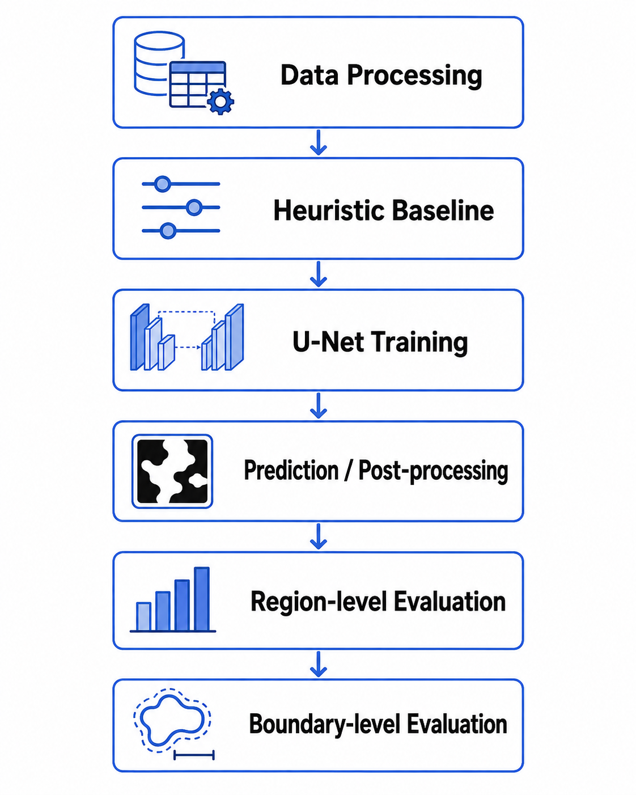
</p>

이를 통해 단순히 모델의 출력 영상을 확인하는 것이 아니라,
**Baseline 대비 성능 개선 여부와 수변 경계 위치의 정확성까지 정량적으로 검증**
할 수 있도록 구성하였습니다.


---

## 3. Requirements & Evaluation KPI

본 프로젝트에서는 모델의 성능을 단순히 결과 영상의 시각적 품질만으로 판단하지 않고,
**영역 분할 정확도와 경계 위치 정확도**를 각각 정량적으로 평가하도록 검증 기준을 구성하였습니다.

즉, 다음 두 가지 질문을 중심으로 성능을 확인하였습니다.

> **1. 수변 관련 영역을 얼마나 정확하게 분할하는가?**  
> **2. 실제 Annotation 경계에 얼마나 가까운 위치에서 경계를 검출하는가?**

이를 위해 Region-level Evaluation과 Boundary-level Evaluation을 분리하여 수행하였습니다.

---

## 3. Requirements & Initial Approach

### 3.1 Requirements & KPI

본 프로젝트에서는 단순히 수변 영역이 시각적으로 잘 검출되는지를 확인하는 것이 아니라,
**영역 분할 정확도와 경계 위치 정확도를 함께 검증하는 것**을 주요 요구사항으로 설정하였습니다.

주요 개발 요구사항은 다음과 같습니다.

- GeoTIFF 항공영상과 JSON Polygon Annotation 처리
- 수변 관련 영역의 Pixel-level Binary Segmentation
- 초기 Baseline과 U-Net을 동일 조건에서 비교
- 영역 분할 성능과 수변 경계 정확도를 각각 정량 검증

성능 평가는 다음 두 관점으로 구성하였습니다.

| Evaluation | KPI |
|---|---|
| **Region-level** | IoU, Precision, Recall, F1-Score |
| **Boundary-level** | Mean Boundary Distance (MBD), Boundary F1 |

이를 통해 **“영역을 얼마나 정확하게 분할했는가”와
“수변 경계를 얼마나 정확한 위치에서 검출했는가”**를 분리하여 평가하였습니다.

---

### 3.2 Initial Approach — From Color to Color + Texture

초기에는 물 영역이 주변 지형과 색상 차이를 보일 것이라고 판단하여,
**RGB 색상 조건만으로 수변 영역을 구분할 수 있을 것이라고 예상**하였습니다.

하지만 실제 항공영상을 분석하면서 다음 문제를 확인하였습니다.

- 숲 영역이 어두운 녹색 계열로 나타남
- 일부 수역 역시 짙은 녹색 계열로 관측됨
- 따라서 색상 정보만으로 물과 숲을 안정적으로 구분하기 어려움

이 문제를 해결하기 위해 색상 이외의 영상 특성을 추가로 고려하였습니다.

항공영상에서 숲은 나무와 식생으로 인해 상대적으로 **거친 Texture**를 나타내는 반면,
수면은 상대적으로 **매끄러운 Texture**를 나타낸다는 점에 착안하였습니다.

따라서 초기 Color 기반 접근을 다음과 같이 확장하였습니다.

<p align="center">
  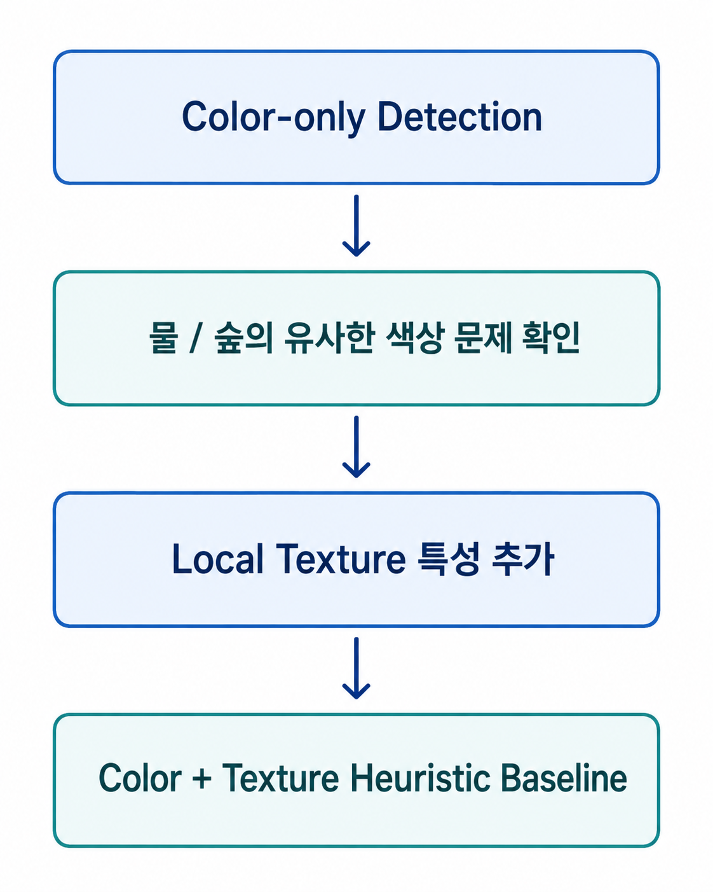
</p>

최종 Heuristic Baseline에서는 다음 정보를 함께 사용하였습니다.

- RGB Channel 조건
- Green / Red Channel 관계
- Local Standard Deviation
- Morphological Processing
- Connected Component 분석

---

### 3.3 Baseline as a Comparison Reference

Color + Texture 방식은 최종 모델이 아니라,
이후 학습 기반 방법의 성능 개선 여부를 확인하기 위한 **Baseline**으로 활용하였습니다.

동일한 Annotation 조건에서 Heuristic과 U-Net을 비교하여,

> **학습 기반 접근이 규칙 기반 접근보다 실제로
> 영역 분할과 경계 검출 성능을 개선하는가?**

를 정량적으로 확인하는 방향으로 프로젝트를 진행하였습니다.


---

## 4. Problem Analysis & U-Net Improvement

### 4.1 Problem Analysis — Limitation of Rule-based Detection

Color + Texture를 결합하면서 Color-only 방식보다 물과 숲을 구분할 수 있는 기준은 늘어났지만,
Heuristic 방식은 여전히 **사전에 설정한 Threshold와 규칙에 결과가 크게 의존**한다는 한계가 있었습니다.

Baseline에서는 다음과 같은 조건을 직접 설정하여 수변 후보 영역을 판단하였습니다.

- RGB Channel Threshold
- Green / Red Channel 관계
- Local Standard Deviation Threshold
- Morphological Filtering
- Connected Component 기반 영역 정제

이 방식은 조건에 부합하는 영상에서는 수변 후보를 빠르게 추출할 수 있지만,
영상의 밝기, 색상 분포, 주변 지형 및 질감 특성이 달라질 경우
동일한 고정 Threshold를 안정적으로 적용하기 어렵다는 구조적인 문제가 있습니다.

즉, 다음과 같은 한계를 확인하였습니다.

> **사람이 정의한 Color / Texture 조건만으로 다양한 항공영상의 수변 특징을 모두 표현하기 어렵다.**

따라서 규칙을 계속 추가하는 방식보다,
영상으로부터 수변 영역의 특징을 학습할 수 있는 Segmentation Model이 필요하다고 판단하였습니다.

---

### 4.2 Improvement — U-Net Binary Segmentation

Heuristic의 고정 규칙 의존성을 줄이기 위해
Pixel-level Semantic Segmentation 구조인 **U-Net**을 적용하였습니다.

U-Net은 Encoder에서 영상의 특징을 단계적으로 추출하고,
Decoder에서 공간 정보를 복원하면서 Skip Connection을 통해
저수준 위치 정보와 고수준 특징 정보를 함께 활용하도록 구성되어 있습니다.

본 프로젝트에서는 RGB 항공영상을 입력으로 받아
각 Pixel이 수변 관련 영역일 확률을 나타내는
**Water Probability Map**을 생성하도록 학습하였습니다.

<p align="center">
  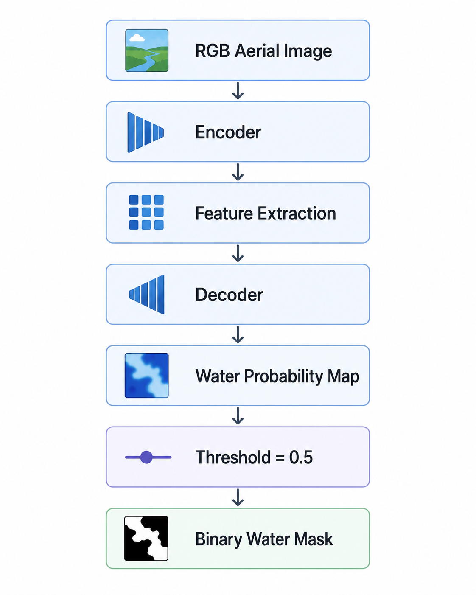
</p>

주요 학습 설정은 다음과 같습니다.

| Item | Setting |
|---|---|
| Input Size | 512 × 512 |
| Architecture | U-Net |
| Input Channel | RGB, 3 channels |
| Output Channel | 1 |
| Loss | BCEWithLogitsLoss |
| Positive Class Weight | 3.0 |
| Optimizer | Adam |
| Learning Rate | 1e-4 |
| Epochs | 30 |

수변 관련 Positive Class의 불균형을 고려하여
`BCEWithLogitsLoss(pos_weight=3.0)`을 적용하였으며,
Validation Loss가 가장 낮은 모델을 최종 Checkpoint로 저장하였습니다.

---

### 4.3 Prediction & Post-processing

U-Net의 출력 Probability Map을 그대로 최종 결과로 사용하지 않고,
Threshold 적용 이후 영상 후처리를 수행하여 Binary Mask를 정제하였습니다.

주요 처리 과정은 다음과 같습니다.

1. U-Net Probability Map 생성
2. Threshold `0.5`를 적용하여 Binary Mask 생성
3. Hole Filling
4. Morphological Opening / Closing
5. Connected Component 분석
6. 주요 수변 영역 추출
7. Boundary Extraction

또한 최종 시각화 단계에서는
Color 및 Local Texture 정보를 이용하여 Forest와 Sand/Road 후보 영역을 추가적으로 분석하였습니다.

즉, 최종 구조는 완전한 규칙 기반 방식이나
U-Net 단독 방식 중 하나를 선택하는 것이 아니라,

> **U-Net으로 핵심 수변 영역을 분할하고,  
> 규칙 기반 영상처리를 후처리 단계에 활용하는 Hybrid Pipeline**

으로 구성하였습니다.

이를 통해 초기 Heuristic Baseline과 학습 기반 U-Net을
동일한 평가 조건에서 비교할 수 있는 개선 구조를 구축하였습니다.


---

## 5. Test Setup & Quantitative Verification

### 5.1 Test Setup

U-Net 적용이 실제 성능 개선으로 이어졌는지 확인하기 위해
**Color + Texture Heuristic Baseline과 U-Net을 동일한 조건에서 비교**하였습니다.

| Item | Test Condition |
|---|---|
| Input | RGB Aerial Image |
| Image Size | 512 × 512 |
| Reference | JSON Polygon Annotation 기반 Binary Mask |
| Baseline | Color + Texture Heuristic |
| Proposed Method | U-Net Binary Segmentation |
| U-Net Threshold | 0.5 |
| Region Metrics | IoU / Precision / Recall / F1 |
| Boundary Metrics | MBD / Boundary F1 |

영역 자체의 분할 정확도뿐만 아니라,
**실제 수변 경계가 Annotation 경계와 얼마나 가까운 위치에 형성되는지**까지
별도로 검증하였습니다.

> **Evaluation Note**  
> 본 정량 비교는 JSON Annotation이 존재하는 **학습 데이터 기반 Baseline 비교**입니다.  
> 따라서 독립적인 Test-set Generalization 성능이 아니라,
> 동일 데이터 조건에서 Heuristic 대비 U-Net의 상대적인 개선 효과를 검증하기 위한 결과입니다.

---

### 5.2 Region-level Performance

JSON Annotation 기반 Reference Mask와 예측 Mask를 비교하여
Region-level 성능을 평가하였습니다.

| Metric | Heuristic | U-Net | Improvement |
|---|---:|---:|---:|
| **IoU** | 62.67% | **69.51%** | **+6.84%p** |
| **Precision** | 76.77% | **79.99%** | **+3.22%p** |
| **Recall** | 80.83% | **85.88%** | **+5.05%p** |
| **F1-Score** | 78.74% | **82.82%** | **+4.08%p** |

<p align="center">
  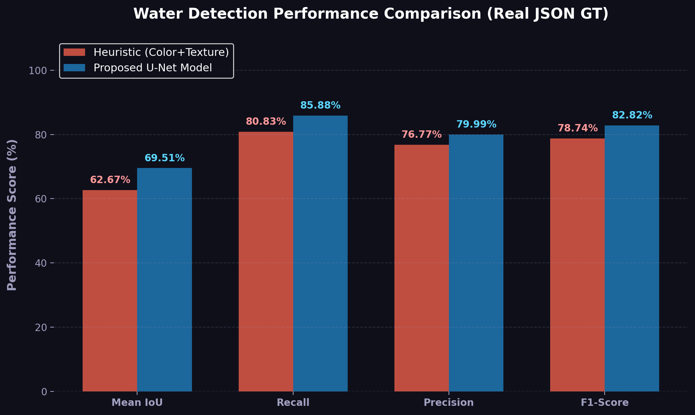
</p>

모든 주요 Region-level 지표에서 U-Net이 Heuristic Baseline보다 높은 성능을 나타냈으며,
특히 **IoU가 62.67%에서 69.51%로 6.84%p 향상**되었습니다.

이는 고정된 Color / Texture 규칙만을 사용하는 방식보다
학습 기반 U-Net이 수변 영역의 공간적 특징을 더 효과적으로 표현할 수 있음을 확인한 결과입니다.

---

### 5.3 Boundary-level Performance

Region-level 성능 향상이 실제 수변 경계 위치의 개선으로 이어지는지 확인하기 위해
예측 Mask와 JSON Annotation에서 Boundary를 추출하여 추가 평가하였습니다.

#### Mean Boundary Distance (MBD)

| Method | Mean Boundary Distance |
|---|---:|
| Heuristic | 37.0 px |
| **U-Net** | **21.8 px** |
| **Reduction** | **15.2 px** |

<p align="center">
  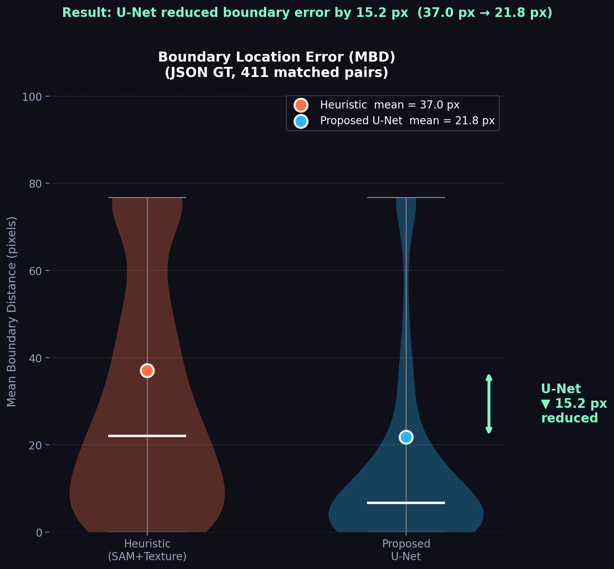
</p>

U-Net 적용 후 평균 경계 위치 오차가
**37.0 px → 21.8 px로 15.2 px 감소**하였습니다.

즉, 영역의 중첩 성능뿐만 아니라
예측된 수변 경계 자체도 Reference Boundary에 더 가까워졌음을 확인하였습니다.

#### Boundary F1 @ Pixel Tolerance

| Tolerance | Heuristic | U-Net | Improvement |
|---|---:|---:|---:|
| **1 px** | 37.7% | **54.8%** | **+17.1%p** |
| **5 px** | 42.9% | **65.7%** | **+22.8%p** |
| **10 px** | 53.7% | **72.8%** | **+19.1%p** |
| **15 px** | 58.4% | **77.6%** | **+19.2%p** |

<p align="center">
  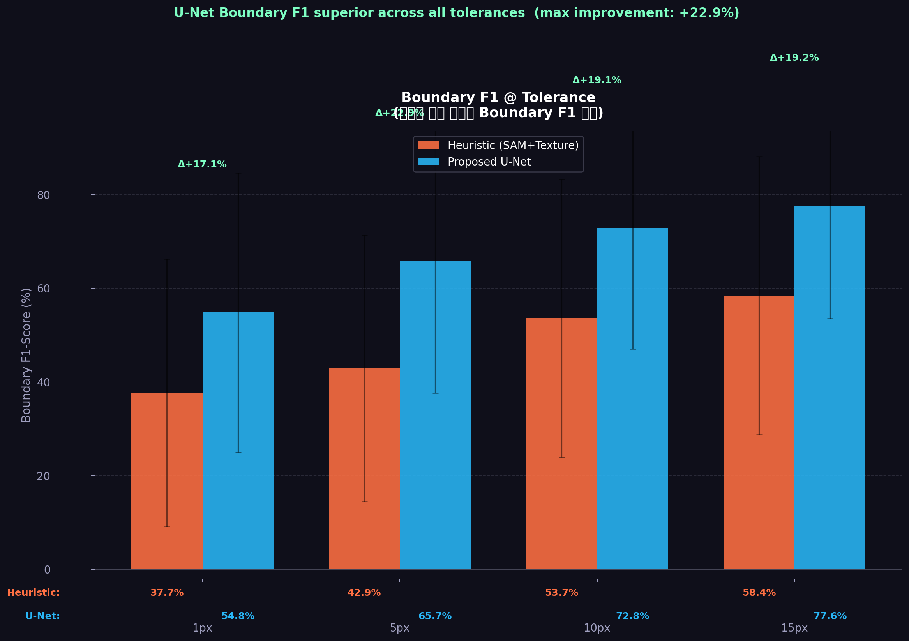
</p>

모든 Pixel Tolerance에서 U-Net의 Boundary F1이 Baseline보다 높게 나타났으며,
특히 **5 px 조건에서 42.9% → 65.7%로 22.8%p 향상**되었습니다.

---

### 5.4 Verification Summary

정량 검증 결과, U-Net 적용을 통해 다음 두 관점의 개선을 확인하였습니다.

<p align="center"> 
  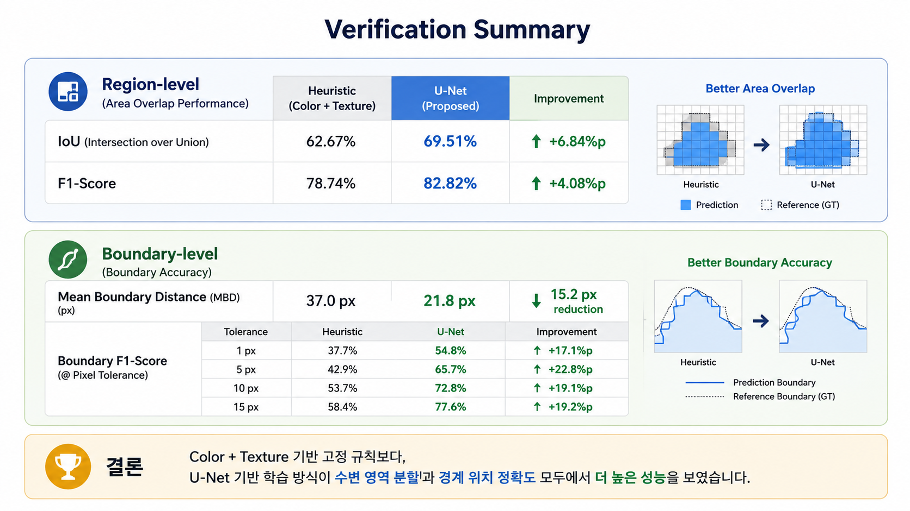 
</p>

> Color + Texture 기반 고정 규칙보다,
> U-Net 기반 학습 방식이 **수변 영역 분할과 경계 위치 정확도 모두에서 더 높은 성능**을 보였습니다.

따라서 초기 Heuristic Baseline에서 확인한 한계를
학습 기반 Segmentation으로 개선하고,
그 효과를 **Region-level과 Boundary-level 두 관점에서 정량적으로 검증**하였습니다.


---

## 6. Results, Limitations & Engineering Takeaways

### 6.1 Qualitative Results

정량 지표뿐만 아니라 실제 항공영상에서
Heuristic Baseline과 U-Net 기반 결과를 비교하여
수변 영역 및 주변 경계의 시각적 차이를 확인하였습니다.

<p align="center">
  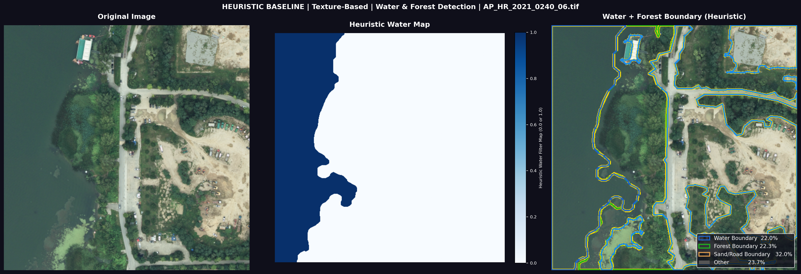
</p>

<p align="center">
  <b>Color + Texture Heuristic</b>
</p>

<p align="center">
  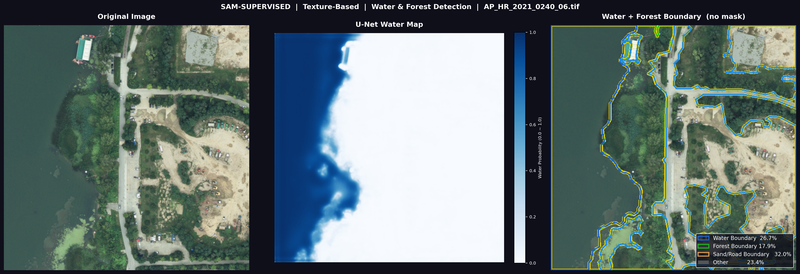
</p>

<p align="center">
  <b>U-Net Hybrid Prediction</b>
</p>

Heuristic 방식은 사전에 정의한 Color / Texture 조건에 따라 수변 후보를 결정하는 반면,
U-Net은 학습된 영상 특징을 기반으로 Water Probability Map을 생성합니다.

정량 평가 결과와 함께 확인했을 때,
U-Net 적용 후 **영역 분할 성능뿐만 아니라 수변 경계 위치 정확도에서도 개선**을 확인하였습니다.

---

### 6.2 Limitations & Future Work

본 프로젝트를 통해 Heuristic 대비 U-Net의 성능 개선을 확인하였지만,
다음과 같은 한계가 남아 있습니다.

- 정량 비교에 사용한 JSON Annotation 데이터가 **학습 데이터에 포함된 데이터**이므로,
  독립 Test-set에 대한 Generalization 성능으로 해석할 수 없음
- 학습용 Binary Mask가 JSON Annotation과 Color / Texture 기반 후보 Mask를
  보완적으로 결합하여 구성되어 있어, **순수 Annotation 기반 학습과의 성능 차이는 별도 검증이 필요**
- U-Net은 Water-related / Other의 **Binary Segmentation** 구조이며,
  Forest 및 Sand/Road 영역은 규칙 기반 영상처리를 이용하여 분석
- 최종 Pipeline에는 Threshold `0.5`, Morphological Processing 등
  일부 고정 Parameter가 여전히 존재

향후에는 다음 방향으로 개선할 수 있습니다.

1. JSON Ground Truth가 충분히 확보된 독립 Validation / Test Dataset 구성
2. Annotation 기반 Training Mask와 Heuristic 보완 Mask의 영향을 분리하여 비교
3. Water / Forest / Sand-Road 등을 직접 학습하는 Multi-class Segmentation 적용
4. 다양한 지역 및 촬영 조건에서의 Generalization 성능 검증

---

### 6.3 Engineering Takeaways

본 프로젝트는 단순히 U-Net 모델을 적용하는 것보다,
**문제를 관찰하고 → Baseline을 만들고 → 한계를 분석하고 → 개선안을 적용한 뒤 → 동일한 기준으로 검증하는 과정**
이 중요하다는 점을 확인한 프로젝트였습니다.

개발 과정은 다음과 같이 정리할 수 있습니다.

<p align="center">
  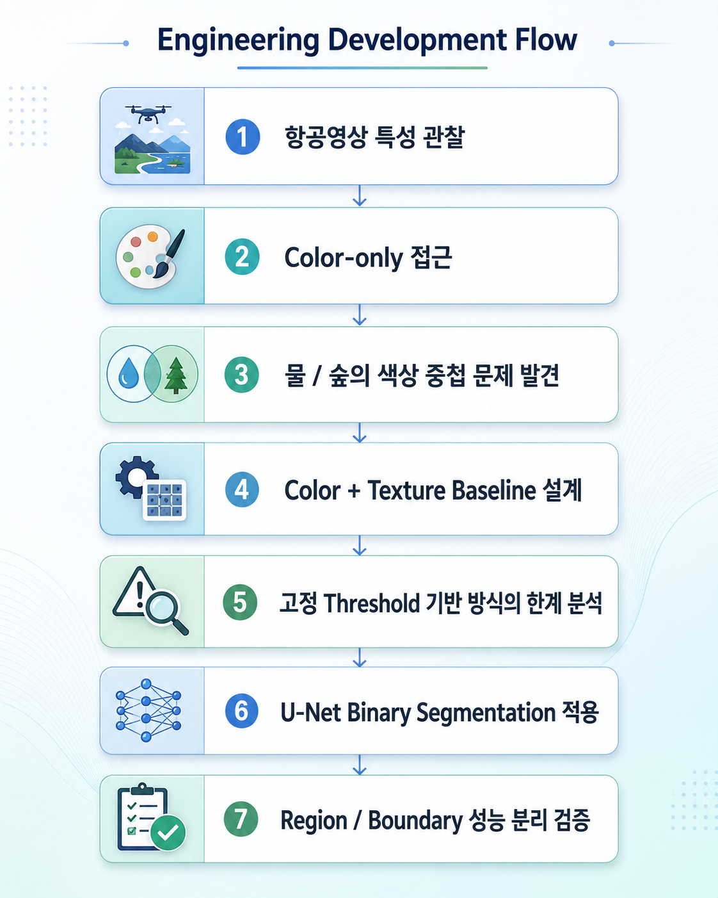
</p>

특히 단순히 결과 이미지가 좋아 보이는지를 판단하는 것이 아니라,

- **Baseline을 먼저 정의하고**
- **동일한 데이터 조건에서 비교하며**
- **Region-level과 Boundary-level KPI를 분리하여**
- **개선 효과와 평가 한계를 함께 확인**

하는 방식으로 개발·검증 과정을 구성하였습니다.

> **Engineering Perspective**  
> 모델 자체의 복잡도보다  
> **문제 정의 → 원인 분석 → 개선 설계 → 시험 조건 설정 → 정량 검증**의 흐름을
> 명확하게 만드는 것이 중요하다는 점을 경험하였습니다.
